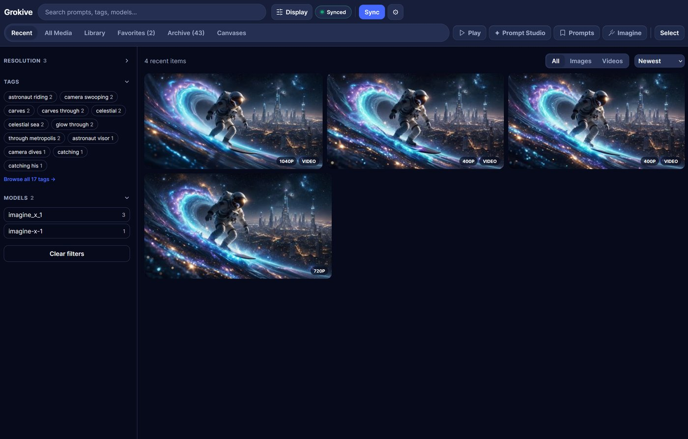
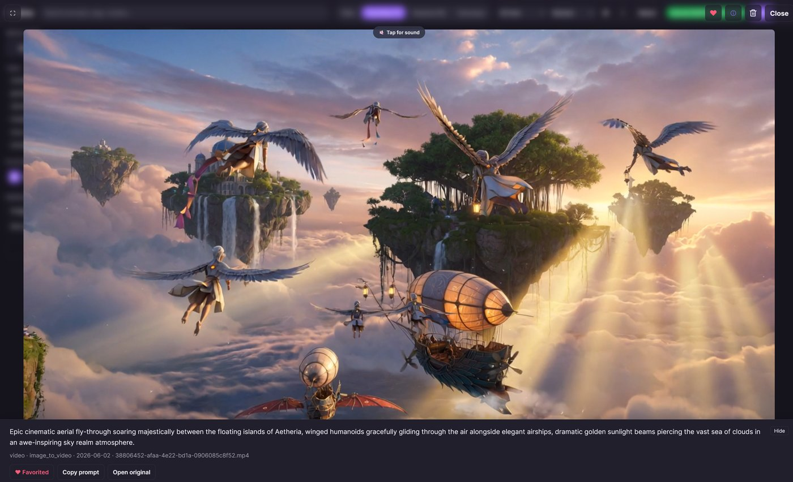
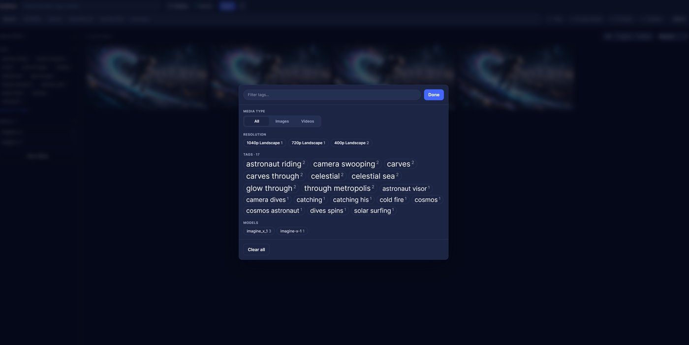
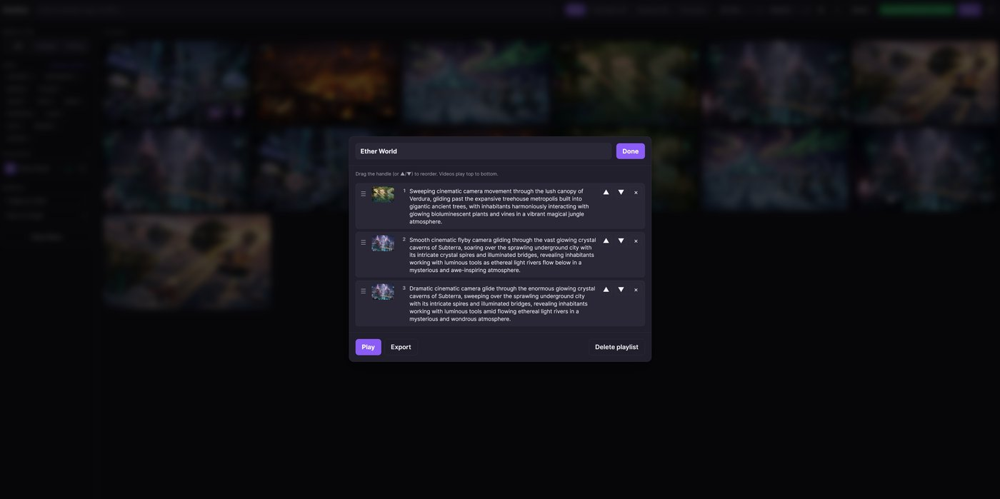
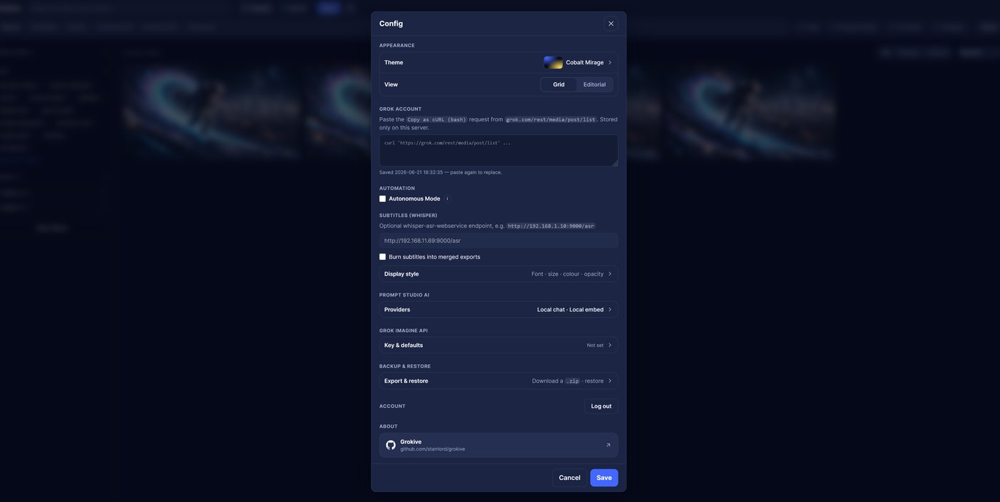
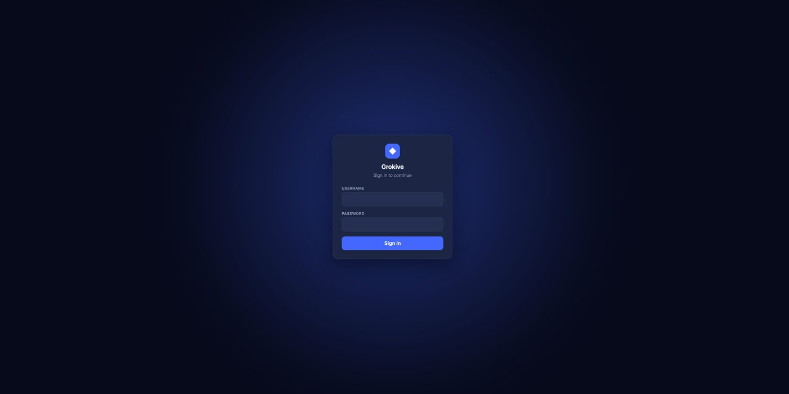

<a href="https://buymeacoffee.com/starrlord"></a>

# Grokive

Download your Grok Imagine favorites and Agent canvases, then browse them in a modern, responsive web app — chain clips into a playlist and export them as one seamless video, auto-generate subtitles for every clip, and burn them straight into the merged file.

Grokive is a free, self-hosted archiver that keeps your Grok Imagine library entirely on hardware you control. You sign in once by pasting a cURL request copied from your browser session; from there the tool pulls your saved media down to local disk. Browsing happens in a **SvelteKit single-page web app** (run via Docker or `python server.py`) backed by a SQLite read-model, with full-text prompt search, favorites, archive, collections, playlists, subtitle generation, themes, and an installable PWA. A small **CLI** handles the downloading and index builds.

## Screenshots

| Library | Lightbox player |
| :---: | :---: |
| [](screenshots/web/main.jpg) | [](screenshots/web/player.jpg) |
| **Tag browser** | **Playlist editor** |
| [](screenshots/web/tags.jpg) | [](screenshots/web/playlist.jpg) |
| **Config** | **Login** |
| [](screenshots/web/config.jpg) | [](screenshots/web/login.jpg) |

## Features

- Bulk-download Grok Imagine saved/favorited images and videos.
- Bulk-download Agent canvases (`/imagine/agent/<id>`) — all canvases or specific ones.
- Download individual posts by link (`/imagine/post/<id>`) — grabs the root media plus all its child posts.
- Resume-safe: rerun anytime; existing IDs are skipped.
- Saves prompt metadata (including canvas name) with every media file.
- Builds a SQLite read-model (`index.db`) with FTS5 full-text search that the web UI queries.
- Incremental: only new thumbnails and records are generated on each sync.
- Groups media created from the same normalized prompt.
- Browse by canvas: a Canvases view with one album per canvas and drill-in that keeps the Canvases context active.
- Search across prompts, tags, models, and local filenames.
- Filter by media type: all, images, or videos.
- Filter by generated prompt tags, model names, and canvas.
- Sort by newest, oldest, prompt A-Z, or model A-Z.
- Open a same-prompt view to see every image/video created from that prompt.
- Click/copy prompts for reuse.
- Show parent media when parent metadata is available.
- Build **collections** for mixed images/videos, or video **playlists** for back-to-back playback with fullscreen auto-advance and drag-to-reorder.
- **Export a playlist** (or an ad-hoc selection) as one merged MP4 — lossless stream-copy when clips match, otherwise a high-fidelity re-encode (audio always kept).
- **Song Beat Montage:** pick videos + a song and the server cuts a beat-synced montage — motion peaks landed on the beat and cut density that follows the song's energy. Pick a **style** — Classic (punchy hard cuts), Cinematic (smarter analysis, beat-timed transitions, on-beat zoom punch), or Moody (long held shots with a slow push-in, punctuated by beat bursts) — with GPU-accelerated rendering and one-click **Add to Collection**.
- **Prompt Studio:** build Grok Imagine prompts the way Grok works — a **two-stage composer** that emits a detailed **Image** prompt (the base still) and a short **Motion** prompt (to animate it), with a **Voice/Accent** control and suggestion chips mined from your own vocabulary. A **Scene Builder** scripts a whole multi-clip scene as numbered beats for Grok's *Extend from Frame* chaining. With an optional self-hosted LLM/embeddings endpoint it adds semantic *"more like this"* search, auto-discovered **theme clusters**, and AI **Variations / Remix / Polish** (in your style, with fresh dialogue) — all on your own hardware.
- Optional **subtitle generation** via a [Whisper ASR](https://github.com/ahmetoner/whisper-asr-webservice) server: writes `.srt`/`.vtt` per video, shows captions in the player, and can burn them into merged exports.
- **Modern web app (Docker):** a SvelteKit SPA backed by a SQLite + FTS5 read-model — paginated browsing, full-text prompt search, a justified photo grid, infinite scroll, and an installable **PWA** (great on iPhone).
- **Favorites, Archive, and All Media:** ♥ items into Favorites; archive items to hide them from Recent while keeping them available in Archive, All Media, Collections, and Canvases.
- **Delete:** permanently remove an item (file + thumbnail + subtitles) from a thumbnail, the viewer, or in bulk via select mode. Deleted IDs are blocklisted in `deleted_ids.json` so future syncs never re-download them.
- **Themes** (Violet default, Classic, Light) and **layouts** (Grid, Editorial) — switchable in Config.
- Self-hosted and local-first: everything stays on your own hardware — no analytics, no external services, no account required.

## Run As A Docker Container (Unraid / self-hosted)

Instead of the CLI you can run the archiver as a web app. The container serves the
modern SvelteKit UI at `/` (see *Web App* below) backed by a small Flask API, plus a
**Sync** action that downloads favorites + Agent canvases and rebuilds the index, and a
**Config** panel to paste your captured cURL — no shell access needed. When a Whisper
server is configured (see *Subtitles*), a **Generate Subtitles** button also appears.
Long jobs stream their progress into an on-page **Log** overlay.

All state (`grok_auth.txt`, `metadata.json`, `index.db` (the derived SQLite
read-model), `library.json` (favorites/archive), `deleted_ids.json` (delete blocklist),
`playlists.json`, `collections.json`, `settings.json`, `scenes.json` (saved Scene Builder
scenes), `prompt_studio.db` (durable prompt embeddings),
media, thumbnails, subtitle `.srt`/`.vtt` sidecars, and the built gallery) is written
under one volume: the container's `/data` (set via the `GROK_DATA_DIR` env var), so it
survives container updates. `index.db` is purely derived from `metadata.json` and
on-disk files, and is rebuilt automatically on startup and after each sync.

### docker compose

```bash
docker compose up -d --build
# open http://<host>:8080
```

1. Open the web UI and click **Config**.
2. Paste your `Copy as cURL (posix/bash)` request (see *Capture Your Grok Auth Request*) and Save.
3. Click **Sync**. The status pill shows progress; the gallery refreshes when done.

### Unraid

The published image (`ghcr.io/starrlord/grokive:latest`) is pulled automatically — no
building on the server needed.

1. **Install the template** so it shows up in *Docker → Add Container → Template*: drop
   **`my-grokive.xml`** into the user-templates folder on the flash drive. From an Unraid
   terminal/SSH:
   ```bash
   wget -O /boot/config/plugins/dockerMan/templates-user/my-grokive.xml \
     https://raw.githubusercontent.com/starrlord/grokive/main/my-grokive.xml
   ```
   (The `my-` prefix marks it as a user template; `dockerMan` is Unraid's Docker
   manager.) Then go to **Docker → Add Container** and pick **grokive** from the
   *Template* dropdown.
2. Or skip the file copy and just **Add Container** → fill in manually:
   - **Repository:** `ghcr.io/starrlord/grokive:latest`
   - **Port:** `8080`
   - **Path:** `/data` → `/mnt/user/appdata/grokive`
   - **PUID/PGID:** `99` / `100` (defaults; downloads are owned by `nobody:users`)
3. Apply, then open the WebUI, set **Config**, and click **Sync**.

### Environment variables

| Variable | Default | Purpose |
| --- | --- | --- |
| `GROK_DATA_DIR` | `/data` | Where all state is stored. |
| `PORT` | `8080` | Web UI port. |
| `PUID` / `PGID` | `99` / `100` | File ownership for downloaded media. |
| `ADMIN_USER` / `ADMIN_PASSWORD` | `admin` / _(auto)_ | Login credentials for the **themed login screen**. If `ADMIN_PASSWORD` is unset, a strong password is generated on first run and **printed to the container log** (and saved to `admin_password.txt`). |
| `AUTH_DISABLED` | `false` | Set `true` to turn auth **off** (open UI). Only do this on a fully trusted, isolated LAN. |
| `TRUST_PROXY` | `false` | Set `true` when behind a reverse proxy so the app trusts `X-Forwarded-*` (real client IPs for rate-limiting, HTTPS detection for secure cookies). |
| `SESSION_COOKIE_SECURE` | `auto` | `true`/`false`/`auto`. `auto` = secure cookies when `TRUST_PROXY` is on (i.e. HTTPS at the proxy). Don't force `true` on plain HTTP or login won't persist. |
| `BASIC_AUTH_USER` / `BASIC_AUTH_PASS` | _(unset)_ | Legacy HTTP Basic auth (used instead of the login screen when set). |
| `SESSION_SECRET` | _(derived)_ | Optional override for the session-cookie signing key (otherwise derived from the admin credentials). |
| `WHISPER_SERVER_URL` | _(unset)_ | Whisper ASR endpoint (e.g. `http://host:9000/asr`). Enables the **Generate Subtitles** button. Overrides the value saved in **Config**. |
| `EMBED_SERVER_URL` | _(unset)_ | Embeddings endpoint for **Prompt Studio** (Ollama / OpenAI-compatible `/v1` base, e.g. `http://host:11434/v1`). Enables semantic prompt search and theme clusters. Overrides **Config**. |
| `EMBED_MODEL` | `nomic-embed-text` | Embedding model name (only used when `EMBED_SERVER_URL` is set). |
| `LLM_SERVER_URL` | _(unset)_ | Chat endpoint for **Prompt Studio** AI Variations / Remix / Polish (Ollama / OpenAI-compatible `/v1` base). Overrides **Config**. |
| `LLM_MODEL` | `dolphin3` | Chat model name (only used when `LLM_SERVER_URL` is set). |
| `VIDEO_ENCODER` | `auto` | Re-encoder for playlist merges and burned-in subtitles. `auto` uses the NVIDIA GPU (NVENC) when one is visible to the container, else CPU `libx264`. Force with `nvenc` or `cpu`. See *GPU video encoding* below. |
| `SPA_DIR` | `/app/web/build` | Where the built SvelteKit app lives (advanced; the image sets this for you). |

Log out from **Config → Account**. Your Grok cURL cookies expire periodically — when a
sync fails with an auth error the status pill says *"Auth failed — update Config"*;
re-capture the cURL and paste it into **Config** again.

### GPU video encoding (NVIDIA NVENC)

Exporting a playlist (or selection) re-encodes only when the clips differ in
codec/resolution/frame-rate — clips that already match are concatenated **losslessly**
with no encode (so the GPU doesn't change that fast path). When a re-encode *is* needed
(mixed-resolution merges, or burning in subtitles), Grokive can offload it to an NVIDIA
GPU via **NVENC**, which is far faster than CPU `libx264` and frees up your cores.

By default (`VIDEO_ENCODER=auto`) the app probes once whether NVENC can initialise and
uses the GPU if so, otherwise it transparently falls back to `libx264` — so the same
image runs everywhere. Force it with `VIDEO_ENCODER=nvenc` or `VIDEO_ENCODER=cpu`. The
bundled ffmpeg already includes `h264_nvenc`; no rebuild is needed. Encoding uses H.264
(widest compatibility), so any NVENC-capable card works (GTX 10-series and newer, incl.
the RTX 30-series). Only the encode runs on the GPU; decoding and scaling stay on the CPU.

**What you need:**

1. **A visible GPU + driver on the host.** On Unraid, install the **Nvidia Driver**
   plugin (Community Apps) and reboot; note your card's UUID with `nvidia-smi -L`.
2. **Pass the GPU into the container.** On Unraid, edit the grokive container (advanced
   view) and add:
   - **Extra Parameters:** `--runtime=nvidia`
   - **Variable** `NVIDIA_VISIBLE_DEVICES` = `GPU-<your-uuid>` (or `all`)
   - **Variable** `NVIDIA_DRIVER_CAPABILITIES` = `all` (must include `video` for NVENC)

   With `docker run`, that's simply `--gpus all`:
   ```bash
   docker run -d --gpus all -p 8080:8080 -v ./data:/data ghcr.io/starrlord/grokive:latest
   ```
   With `docker compose`, set `runtime: nvidia` and pass the NVIDIA environment
   overrides into the service:
   ```yaml
   services:
     grokive:
       # …existing config…
       runtime: nvidia
       environment:
         # `all` capabilities includes `video` (required for NVENC) and `utility` (nvidia-smi).
         - NVIDIA_VISIBLE_DEVICES=all
         - NVIDIA_DRIVER_CAPABILITIES=all
   ```
3. Nothing else — `VIDEO_ENCODER` stays `auto`.

**Verify it's working:** the container log prints `video encoder: NVENC (GPU)` on the
first export (or `libx264 (CPU)` if no GPU was found). You can also run `nvidia-smi`
inside the container and watch the encoder engage during a merge. (This requires the
NVIDIA Container Toolkit, which the Unraid plugin provides; without a GPU the app simply
uses the CPU.)

## Security

**Auth is on by default.** On first run with no `ADMIN_PASSWORD` set, the app generates a
strong admin password, prints it to the container log, and saves it to
`admin_password.txt` on the `/data` volume — so check the logs (or that file) to sign in,
or set your own `ADMIN_USER`/`ADMIN_PASSWORD`. Login is brute-force-limited (5 failed
attempts per IP → a 5-minute lockout), credentials are compared in constant time, and the
session is a signed, `HttpOnly`, `SameSite=Lax` cookie. The Grok cURL cookies are never
returned to the browser, only stored under `/data`.

- **Trusted internal LAN.** Plain HTTP is usually acceptable. Keep auth on, or set
  `AUTH_DISABLED=true` if the network is fully trusted and isolated. Still protect the
  `/data` volume (it holds your Grok login cookies and media).
- **Exposed outside your LAN / over the internet.** Put it behind an **HTTPS reverse
  proxy** (Nginx Proxy Manager, Caddy, Traefik, Cloudflare Tunnel, …) — the app speaks
  plain HTTP and has no built-in TLS. Then set **`TRUST_PROXY=true`** (so it sees real
  client IPs and marks the session cookie `Secure`), use a **strong `ADMIN_PASSWORD`**,
  and consider IP allow-listing or the proxy's own auth as a second layer. Never expose
  it directly without TLS — the session cookie would travel in clear text. Also raise the
  proxy's read/send timeouts so large playlist exports aren't cut off mid-merge — see
  [Reverse proxy timeouts for large exports](#reverse-proxy-timeouts-for-large-exports).

> The same `GROK_DATA_DIR` mechanism works for the CLI too: set the env var and
> `grokive.py` reads/writes that directory instead of the repo folder.

## Web App (Modern UI)

When run in Docker, the archiver serves a **SvelteKit** single-page app at `/`, backed
by a SQLite read-model (`db.py` → `index.db`, with FTS5 full-text search) and a small
Flask API (`/api/media`, `/api/facets`, …). Highlights:

- **Views:** Recent, All Media, Collections, Favorites, Archive, and Canvases tabs. All Media intentionally shows everything that still exists on disk, independent of archive or collection membership.
- **Collections:** group mixed images and videos into named cards with covers, then drill into each collection with the normal gallery controls and scoped tag/resolution filters.
- **Canvases:** browse canvas cards, drill into a canvas without leaving the Canvases tab, and use Back to return to the canvas grid.
- **Justified photo grid** with infinite scroll and lazy thumbnails (*Grid* mode), or a
  prompt-forward **Editorial** layout — switch in Config.
- **Themes:** Violet (default), Classic, and Light (Config → Appearance). The ☾/☀ button
  quick-toggles light.
- **Search & filters:** full-text prompt/tag/model search in the top bar; a searchable
  **tag-cloud** modal (*Browse all tags*); media-type and model filters; one-click reset
  (the "Grokive" wordmark or the *Reset filters* chip).
- **Favorites & Archive:** hover a card for ♥ (favorite) and the archive icon (hide from
  Recent; reversible from the Archive view).
- **Select mode:** multi-select plus compact Select Visible / Next 25 helpers for bulk favorite/archive, **Add to Collection**, **Save as playlist**, or a
  one-off **Export**.
- **Lightbox:** the media fills the window; press `i` / tap ⓘ for prompt + actions, `f`
  for fullscreen, arrows to navigate; subtitle track shown when available.
- **Installable PWA:** add to your home screen on iOS/Android for a full-screen app.
- **Mobile:** a **Filters** button opens the same tag/model/type modal.

## Playlists And Export

Playlists let you collect a set of videos and watch or export them as one sequence.

- **Create:** click **Select** in the top bar, pick videos (in the order you want them), name the playlist, and **Save**.
- **Play:** click ▶ on a playlist to play its clips back-to-back. Enter fullscreen and each clip auto-advances to the next.
- **Edit:** click a playlist's name to open the editor — drag the handle (or use ▲/▼) to reorder, rename, or remove clips.
- **Export:** click **Export** to merge the playlist into a single MP4 download. Clips that already share codec/resolution/frame-rate are concatenated **losslessly** (no re-encode); if they differ, each is re-encoded onto the largest frame size at high quality. Audio is always preserved (silent clips get a silent track so nothing desyncs).

Export and merging use the server's `ffmpeg`. The merged file is created in a temporary directory, streamed to your browser, and deleted — nothing extra is left on the volume.

### Reverse proxy timeouts for large exports

The whole merge runs **before** the download starts streaming, so a big export (many
clips, or any that need re-encoding) can leave the connection idle for **minutes** while
`ffmpeg` works. Most reverse proxies cut idle upstream connections after ~60s by default,
so the symptom is: **small exports download fine, but large ones spin and then nothing is
delivered** (the proxy 504s the silent connection before the file is ready).

If you run behind a reverse proxy, raise its read/send timeouts. In **Nginx Proxy
Manager**: open the proxy host → **Advanced** → *Custom Nginx Configuration*:

```nginx
proxy_read_timeout 3600s;
proxy_send_timeout 3600s;
proxy_request_buffering off;
```

(Adjust to taste; `3600s` allows hour-long merges.) Other proxies have equivalents
(Caddy `timeouts`, Traefik `responseForwarding`/`forwardingTimeouts`). Enabling
[GPU encoding](#gpu-video-encoding-nvidia-nvenc) also shrinks the merge time, making
timeouts far less likely. Exports on a trusted LAN with no proxy in front aren't affected.

## Song Beat Montage

Turn a handful of clips and a song into a tight, **beat-synced montage** — not a
slideshow with cuts, but an edit where the cuts land on the music and each clip's
biggest movement hits *on the beat*. The server analyses the song's beats and energy,
analyses motion in each clip, plans a cut list, and renders the result on the GPU.

**Open it:** click **Select** in the top bar, pick **2 or more videos** (5+ gives the
planner more to work with), then click **🎬 Movie** in the selection bar. The clips you
selected become the candidate pool — the montage's order is *computed*, not your pick order.

### Controls

- **Style** — Classic, Cinematic, or Moody (see *Styles* below). Classic is the default.
- **Song** — drag-and-drop or click to choose an audio file (`mp3`, `wav`, `flac`, `m4a`,
  `aac`, `ogg`, `opus`). The montage's length defaults to the song's length and the song
  becomes the only audio track.
- **Cut tightness** — the baseline cut pace, from **Relaxed** (longer takes, ~a clip every
  4 beats — calmer, more cinematic) through **Balanced** to **Tight** (rapid cuts, close to
  one clip per beat — high-energy). On top of this baseline, **cut density automatically
  follows the song's energy**: quiet intros cut sparsely; as the track builds toward a
  drop or chorus the montage accelerates on its own. Great for slow-building songs.
- **Aspect / resolution** — `1080p 16:9`, `720p 16:9`, `Vertical 9:16`, or `Square 1:1`.
  Every clip is normalised (scaled + padded) to this exact frame, so mixed-orientation
  sources combine cleanly.
- **Frame rate** — 24, 30, or 60 fps.
- **Length** — optional override in seconds; leave blank to match the song.
- **File name** — used for the download and as the montage's title in the gallery.

### Styles

A **Style** preset shapes the whole edit. **Classic** stays the default, so existing
montages render exactly as before.

- **Classic** — punchy **hard cuts** on the beat, with cut density driven by the song's
  energy. The original style; the entire render stays on the GPU.
- **Cinematic** — richer music analysis (onset-tightened beats, PLP for tempo-varying
  tracks, and real structural sections), plus tasteful **beat-timed transitions** (a
  dissolve at section changes, a fade-to-black on drops) and a subtle **on-beat zoom
  punch** on each cut. Hard cuts stay the default; transitions only punctuate.
- **Moody** — long **held shots** with a slow **push-in** (Ken Burns), punctuated by quick
  **beat-bursts** where the song gets loud, plus a calmer footage bias so shots breathe.
  Looks best **vertical (9:16)**.

### How it picks and cuts

For each beat-aligned interval, every selected clip competes: the planner finds that
clip's highest-motion window of the needed length, then scores candidates on **motion**,
how well the clip's energy **matches the song's local energy** (calm shots in quiet
passages, hot shots at the peak), minus **recency** and **overuse** penalties so the same
clip doesn't repeat back-to-back and every clip gets screen time. The winner is positioned
so its **motion peak sits exactly on the beat**.

**Every run is different.** Each render explores among the top-scoring clips and moments,
so generating again from the same videos and song yields a fresh — but still good — cut.
Hit **Make another** (or just **Generate** again) to roll a new one.

### Watch, save, and add to your gallery

Generation runs as a **background job** with staged progress (Analysing audio → Analysing
motion, per-clip → Planning cuts → Rendering). It keeps running even if you close the
panel, and reopening reconnects to the live job. When it finishes you get an inline
preview plus:

- **Download MP4** — save the file directly.
- **Add to Collection** — commit the montage into your library under a **“Beat Montage”**
  collection (created automatically the first time). It's stored with a unique filename and
  full provenance (song, style preset, cut count, duration, fps, the random seed, and the
  source clip IDs), gets a thumbnail, and is indexed — so it's searchable, filterable (model **“Beat
  Montage”**), and reusable like any other clip. Until you add or download it, the render
  lives only in a temporary area and is replaced by your next one.

### Requirements & performance

Needs `ffmpeg` on the server (already required) plus **`librosa`** for audio analysis
(included in `requirements-server.txt` and the Docker image). With an NVIDIA GPU and
[NVENC](#gpu-video-encoding-nvidia-nvenc) available, the **Classic** render — decode,
scale, pad, and encode — stays entirely on the GPU, so a multi-minute montage renders in
seconds; without a GPU it falls back to CPU encoding. The **Cinematic** and **Moody**
per-shot zoom (push-in / on-beat punch) uses a CPU-only filter, so those shots render on
the CPU while the final encode still uses NVENC when available. Like exports, the job runs server-side before the
result is ready, so the [reverse-proxy timeout guidance above](#reverse-proxy-timeouts-for-large-exports)
applies. One montage renders at a time.

## Prompt Studio

A **Studio** tab for building Grok Imagine prompts out of your own archive. It follows how Grok
actually works — a **two-stage** flow — and the composer works fully offline; an optional
self-hosted model unlocks the semantic and AI features.

### Two-stage composer

Grok makes a detailed still first (text-to-image), then animates it with a *short* motion prompt
(image-to-video). The composer mirrors that and emits **two** prompts:

- **① Image** (Subject · Wardrobe · Setting · Lighting) — the detailed base frame. Copy → make the still.
- **② Motion** (Action · Camera · **Voice/Accent** · Dialogue · Continuity) — short: what moves, what
  she says, and how. Copy → animate the still. Dialogue is woven in as `she says in a {voice}: "…"`,
  with accent/delivery presets (Southern drawl, slurred, Midwestern, raspy, breathy, …).

Focus any field to reveal **suggestion chips** mined from the phrases you actually use; both prompts
update live. **Browse & Remix** your past prompts to load one back, split across the fields.

### Scene Builder

Grok builds longer video by chaining ~6 s/10 s clips (*Extend from Frame*). The **Scene** tab scripts a
whole continuous scene for one character: pick a **length** (30 s–3 min) and **clip length** (6 s/10 s),
and it works out how many clips you need and writes that many **beats** — each a short prompt with the
on-screen action *and* the spoken line, keeping the same character, outfit, and setting and flowing from
the previous one. Dial it in with **Concise/Detailed** beats, a **Build-an-arc** toggle, and a **Keep in
every beat** anchor (a constant action guaranteed at the start of every beat, for continuity). Copy them
in order into *Extend from Frame*. **Save** and name a scene — its base, direction, beats, and settings —
to reload later, stored under `/data` so it's durable and shared across devices. (Needs an LLM endpoint —
see below.)

### Freeform

The **Freeform** tab is a direct line to the model in your active persona's voice — no beat or format
rules, it just answers. Type a request ("give me 10 in-character lines for the scene…"), choose how many,
and get a numbered list back. An optional **Start each with…** field forces every result to begin with an
exact phrase you choose (prepended deterministically, not left to the model). (Needs an LLM endpoint.)

### AI features (optional, self-hosted)

These mirror the Whisper pattern: point the app at a local **[Ollama](https://ollama.com/)** (or any
OpenAI-compatible) server, and nothing leaves your network — the features run on *your* hardware
against *your* content.

1. Run Ollama with an embedding model and a chat model. `ollama pull nomic-embed-text`
   for embeddings; for chat, set `LLM_MODEL` to your model. A small 8B (e.g. `dolphin3`) works but
   writes incoherent dialogue — a **12B Mistral-Nemo creative/RP finetune** (e.g.
   `hf.co/bartowski/MN-12B-Mag-Mell-R1-GGUF:Q4_K_M`) is far more coherent for in-character lines.
2. Set `EMBED_SERVER_URL` / `LLM_SERVER_URL` (env vars or **Config**) to the server's `/v1` base
   (e.g. `http://<host>:11434/v1`).
3. In **Studio**, click **Build prompt index** once. It embeds your unique prompts (a few seconds),
   stored durably in `prompt_studio.db`.

With those configured you get:

- **Semantic search (≈)** — find the prompts closest in *meaning* to any prompt, returned as thumbnails.
- **Themes** — auto-discovered persona/scenario clusters of your corpus, each labelled and with a cover.
- **Variations / Remix / Polish** (per stage) — generate prompts in your own style: *Variations*
  (alternate takes, freshly worded with brand-new on-theme dialogue), *Remix* (same subject, a new
  setting — with an optional "twist" steer), and *Polish* (one enriched version). **Use** loads a
  result into the composer; **Copy** grabs it. Clicking a past prompt to **Remix** it also uses the
  model to split run-on prompts cleanly into fields (quoted dialogue is preserved verbatim).
- **Scene Builder** — the **Scene** tab described above: a continuous multi-clip scene scripted as
  numbered beats for the *Extend from Frame* workflow, which you can **save and name** to reload later.
- **Persona cards** — save multiple named character/voice definitions ("Ship's AI", "noir detective", "android narrator", …) and
  switch the active one with a click. The active card (who they are, tone, vocabulary, rules) is applied
  to every generation above (Variations / Remix / Polish / Scene Builder), so output speaks in that
  voice. Saved on your device; describe the *voice*, not the output format. New installs ship with an
  example "Noir Detective" card and a matching example base scene so the whole loop is self-explanatory —
  both removable.
- **Freeform** — the **Freeform** tab: a direct, unconstrained request to the model in the active
  persona's voice (numbered list), with an optional **Start each with…** exact prefix.
- **Saved responses** — hit **★ Save** on any result (Scene beats, Freeform items, Variations) to keep
  it in a server-side library you can search, copy, and reuse from the **Saved** tab on any device.

Embeddings live in `prompt_studio.db` keyed by prompt text, so they survive an index rebuild and
only new prompts are ever re-embedded. Saved scenes and responses live in `scenes.json` /
`saved_responses.json` under `/data`.

## Subtitles (Whisper)

The app can generate subtitles for your videos using a
[whisper-asr-webservice](https://github.com/ahmetoner/whisper-asr-webservice) server.

1. Run a Whisper ASR server reachable from the app (default endpoint shape: `http://<host>:9000/asr`).
2. Open **Config** and set **Whisper Server URL** (or set the `WHISPER_SERVER_URL` env var). A **Generate Subtitles** button appears once it's configured.
3. Click **Generate Subtitles**. It transcribes every video without a matching `.srt`, writing `.srt` + `.vtt` next to the video. Progress streams into the **Log** overlay.

- Captions appear as a toggleable track in the lightbox.
- **Burn Subtitles** (a checkbox in **Config**): when enabled, exporting a playlist transcribes the merged video and burns the subtitles in (a re-encode at CRF 18; audio copied through). If transcription fails the export still completes without burned-in subtitles.
- Silent clips get an empty `.srt` (so they aren't re-processed) and no caption track. Whisper can hallucinate text on near-silent audio.
- Audio is extracted locally (16 kHz mono) before upload, so only a small file is sent to the Whisper server.

## Capture Your Grok Auth Request

**Both** the Docker app and the CLI need a copied **cURL** request from your logged-in browser — it carries your Grok login cookies. You only capture it once.

1. Open `https://grok.com/imagine/saved` (or `/imagine/favorites`) and sign in.
2. Open DevTools (`F12`) → **Network** tab → enable **Preserve log** → filter to **Fetch/XHR**.
3. Refresh the page and find a request to `https://grok.com/rest/media/post/list`.
4. Right-click it → **Copy** → **Copy as cURL (posix/bash)**.

- **Docker / web app:** paste it into the **Config** panel and **Save**, then click **Sync**.
- **CLI / from source:** save it to a file named `grok_auth.txt` next to the scripts.

Treat that cURL like a password — it embeds your active login cookies. (`grok_auth.txt` is git-ignored, so it never lands in the repo.)

---

## Running From Source (without Docker)

> **Using Docker? You can skip this entire section.** The container already bundles
> Python, ffmpeg, and the built web app, and its **Sync** / **Config** buttons do
> everything below for you. The steps here are only for **development**, or for running
> on a host **without Docker**.

From source you run the same two pieces directly: `grokive.py` (the CLI that downloads
and indexes) and `server.py` (the Flask + SvelteKit web app).

### Requirements

- Python 3.10 or newer.
- `ffmpeg` — for video thumbnails, playlist merge/export, and subtitle audio extraction.
- Node.js 18+ — only to build the web UI; `server.py` serves the prebuilt SPA from `web/build`.
- Python packages from `requirements-server.txt` (it includes `requirements.txt`).

### Set up and run

Windows (PowerShell):

```powershell
python -m venv .venv
.\.venv\Scripts\Activate.ps1
python -m pip install -r requirements-server.txt
python grokive.py check                      # verify dependencies
# create grok_auth.txt (see "Capture Your Grok Auth Request" above)
python grokive.py download                   # favorites
python grokive.py agents                     # optional: Agent canvases
python grokive.py index                      # thumbnails + index.db
cd web; npm install; npm run build; cd ..    # build the SPA (one-time / after UI changes)
python server.py                             # then open http://localhost:8080
```

macOS / Linux:

```bash
python3 -m venv .venv
source .venv/bin/activate
python -m pip install -r requirements-server.txt
python grokive.py check
# create grok_auth.txt (see above)
python grokive.py download
python grokive.py agents
python grokive.py index
( cd web && npm install && npm run build )
python server.py
```

Auth works the same as Docker (see *Security*): on first run a generated admin password
is printed to the console and saved to `admin_password.txt`. Set `ADMIN_USER`/`ADMIN_PASSWORD`,
or `AUTH_DISABLED=true`, before starting if you prefer.

### Downloading

`python grokive.py download` fetches favorites; `python grokive.py agents` fetches Agent
canvases (all of them, or pass specific IDs / `/imagine/agent/<id>` URLs). Both write to
`media/images/`, `media/videos/`, and `metadata.json`, and skip anything already
downloaded. Shortcut: `python grokive.py all` runs download → index in one go.

To grab a single post rather than your whole library, `python grokive.py post <id-or-url> [...]`
downloads one or more posts by id or `/imagine/post/<id>` link (the root media plus its
child posts) — same resume-safe, skip-existing behavior. Run `python grokive.py index`
afterwards if you want it in the web UI.

### CLI-only mode (no web UI)

If you just want your media as local files — no browsing interface — you only need the
downloader:

```powershell
python grokive.py download      # add `python grokive.py agents` for canvases
```

That leaves your images/videos under `media/` and a `metadata.json` describing them, and
nothing else runs (no server, no Node, no index). There is no standalone HTML gallery; to
*browse* in the app you additionally run `python grokive.py index` and `python server.py`
as shown above.

### Developing the web UI

For live-reload development, run the Vite dev server (it proxies the API to Flask), with
`python server.py` running in another terminal:

```bash
cd web && npm run dev    # http://localhost:5173 ; proxies /api, /media, /thumbnails -> :8080
```

### Updating later

```powershell
python grokive.py download
python grokive.py index
```

Existing media and thumbnails are skipped. Reuse the same `grok_auth.txt` while it
works; re-capture it if Grok auth starts failing. (In the web app the **Sync** button does
all of this for you.)

### Run from an IDE

The same commands work from any IDE terminal (VS Code, PyCharm, Cursor, …): open the
folder, create a venv, install `requirements-server.txt`, create `grok_auth.txt`, then
run `grokive.py download` / `index` and `server.py`.

## Privacy

Everything runs on hardware you control. The app keeps your media, prompts, cookies, and metadata on local disk and never ships them to a third party — the only outbound traffic is the calls to Grok it makes on your behalf, signed with the cURL session you supply. The lone exception is optional subtitle generation, which reaches out to a Whisper server only when you choose to configure one (and that can be a box on your own LAN).

## Disclaimer

This is an independent project with no affiliation to xAI, Grok, or X. It depends on Grok's private endpoints, which can change at any time and break it without warning. Archive only content your own account can access, and use it responsibly.
