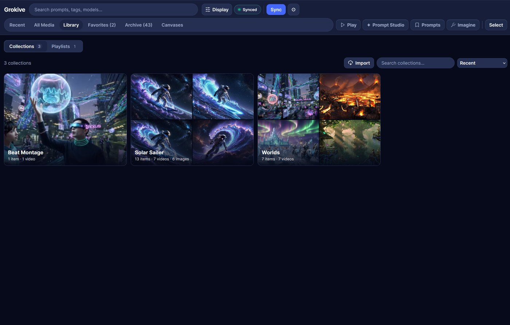
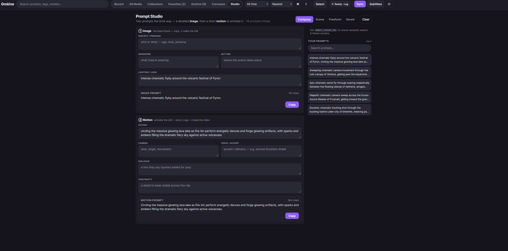
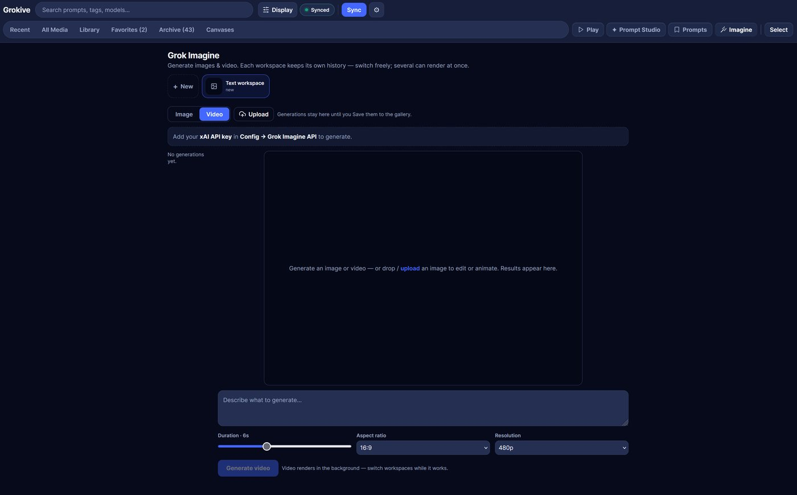
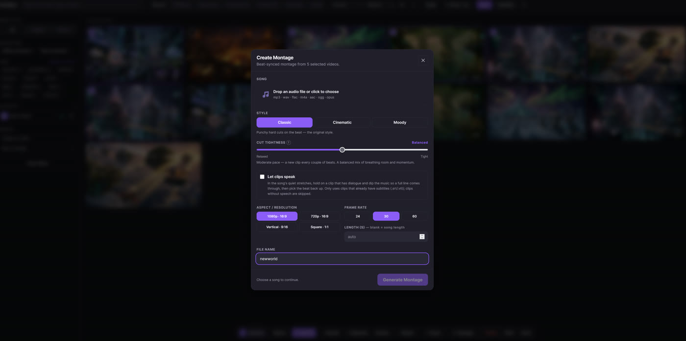
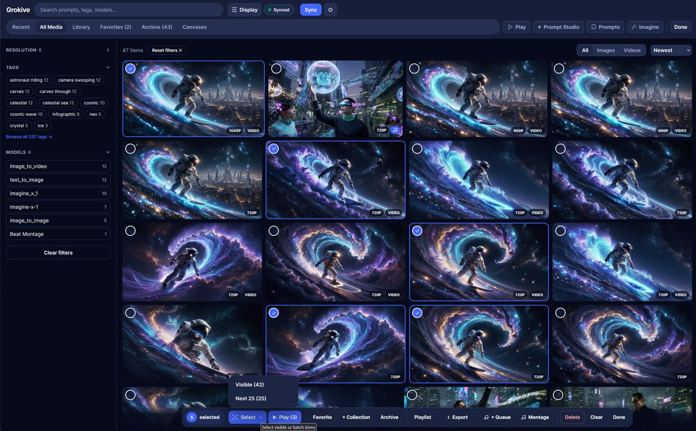

<a href="https://buymeacoffee.com/starrlord"></a>

# Grokive

[](LICENSE)

Download your Grok Imagine favorites and Agent canvases, then browse them in a modern, responsive web app — chain clips into a playlist and export them as one seamless video, auto-generate subtitles for every clip, and burn them straight into the merged file.

Grokive is a free, self-hosted archiver that keeps your Grok Imagine library entirely on hardware you control. You sign in once by pasting a cURL request copied from your browser session; from there the tool pulls your saved media down to local disk. Browsing happens in a **SvelteKit single-page web app** (run via Docker or `python server.py`) backed by a SQLite read-model, with full-text prompt search, favorites, archive, collections, playlists, subtitle generation, themes, and an installable PWA. With an xAI key it can also **generate new images and video** with the **Grok Imagine API** straight into your library. A small **CLI** handles the downloading and index builds.

## Screenshots

| Library | Collections |
| :---: | :---: |
| [](screenshots/web/main.jpg) | [](screenshots/web/collections.jpg) |
| **Lightbox player** | **Tag & filter browser** |
| [](screenshots/web/player.jpg) | [](screenshots/web/tags.jpg) |
| **Prompt Studio** | **Config** |
| [](screenshots/web/studio.jpg) | [](screenshots/web/config.jpg) |
| **Grok Imagine** | **Beat Montage** |
| [](screenshots/web/imagine.jpg) | [](screenshots/web/montage.jpg) |
| **Multi-select** | **Login** |
| [](screenshots/web/multiselect.jpg) | [](screenshots/web/login.jpg) |

## Contents

- [Features](#features)
- [Run as a Docker container](#run-as-a-docker-container-unraid--self-hosted)
  - [docker compose](#docker-compose)
  - [Unraid](#unraid)
  - [Environment variables](#environment-variables)
  - [GPU video encoding (NVENC)](#gpu-video-encoding-nvidia-nvenc)
- [Security](#security)
- [Web App](#web-app-modern-ui)
  - [Collection groups](#collection-groups)
- [Playlists and export](#playlists-and-export)
- [Song Beat Montage](#song-beat-montage)
- [Prompt Studio](#prompt-studio)
- [Firefox extension](#firefox-extension-prompt-studio-companion)
- [Grok Imagine (generate images & video)](#grok-imagine-generate-images--video)
- [Subtitles (Whisper)](#subtitles-whisper)
- [Backup & Restore](#backup--restore)
- [Capture your Grok auth request](#capture-your-grok-auth-request)
- [Running from source](#running-from-source-without-docker)
- [Privacy](#privacy)
- [License](#license)
- [Disclaimer](#disclaimer)

## Features

- Bulk-download Grok Imagine saved/favorited images and videos.
- Bulk-download Agent canvases (`/imagine/agent/<id>`) — all canvases or specific ones.
- Download individual posts by link (`/imagine/post/<id>`) — grabs the root media plus all its child posts.
- Resume-safe: rerun anytime; existing IDs are skipped.
- Saves prompt metadata (including canvas name) with every media file.
- Builds a SQLite read-model (`index.db`) with FTS5 full-text search that the web UI queries.
- Incremental: only new thumbnails and records are generated on each sync.
- Groups media created from the same normalized prompt.
- Browse by canvas: a Canvases view with one album per canvas and drill-in that keeps the Canvases context active.
- Search across prompts, tags, models, and local filenames.
- Filter by media type: all, images, or videos.
- Filter by generated prompt tags, model names, and canvas.
- Filter by **time period** (last hour through this year) and resolution.
- Sort by newest, oldest, largest, smallest, prompt A-Z, or model A-Z.
- Open a same-prompt view to see every image/video created from that prompt.
- Click/copy prompts for reuse.
- Show parent media when parent metadata is available.
- Build **collections** for mixed images/videos, organize related collections into named **collection groups**, or make video **playlists** for back-to-back playback with fullscreen auto-advance and drag-to-reorder. Collections and playlists live together under a **Library** tab.
- **Import a folder** of your own videos/images straight into a new or existing collection — files are copied in with thumbnails and indexed alongside your synced media.
- **Export a playlist** (or an ad-hoc selection) as one merged MP4 — lossless stream-copy when clips match, otherwise a high-fidelity re-encode (audio always kept).
- **Song Beat Montage:** pick videos + a song and the server cuts a beat-synced montage — motion peaks landed on the beat and cut density that follows the song's energy. Pick a **style** — Classic (punchy hard cuts), Cinematic (smarter analysis, beat-timed transitions, on-beat zoom punch), or Moody (long held shots with a slow push-in, punctuated by beat bursts) — with optional GPU-accelerated rendering (NVENC when available, else CPU) and one-click **Add to Collection**. Gather clips into a cross-library **Montage basket** to build one montage from videos spread across collections and canvases.
- **Prompt Studio:** build Grok Imagine prompts the way Grok works — a **two-stage composer** that emits a detailed **Image** prompt (the base still) and a short **Motion** prompt (to animate it), with a **Voice/Accent** control and suggestion chips mined from your own vocabulary. A **Scene Builder** scripts a whole multi-clip scene as numbered beats for Grok's *Extend from Frame* chaining. With an optional LLM/embeddings endpoint it adds semantic *"more like this"* search, auto-discovered **theme clusters**, and AI **Variations / Remix / Polish / Enhance** (in your style, with fresh dialogue). Use local Ollama for local-only AI, or OpenAI/OpenRouter when you want a remote provider.
- **Grok Imagine generation (xAI):** generate brand-new **images and video** from text — or from a **source image** (edit a still, or animate it) — in its own **Grok Imagine** view. Work in multiple **workspaces** that each keep their own history and can render videos concurrently, bring an image in via **Use as source** (gallery), a previous generation, or an **upload** (button or drag-and-drop), then **Save to Gallery** the keepers (tagged with a ✨ badge and linked back to their source). Needs an xAI API key (`XAI_API_KEY` or **Config**).
- **Describe for Grok (image → prompt):** a ⚡ button on any image in the lightbox reads the picture *and* its saved prompt with a **vision model** and writes a ready-to-paste Grok Imagine prompt — character, wardrobe, action, setting, and camera — which you can edit and **save straight into Prompt Studio**. Point it at a self-hosted multimodal model (e.g. a Qwen3-VL build in Ollama) to keep it local.
- **Firefox companion add-on** (*Grokive Prompt Studio*): surfaces your saved prompt library on **grok.com** — pull a random prompt, enhance or vary it, and save it back, writing straight into the page's prompt field. Talks only to your own server. See [Firefox extension](#firefox-extension-prompt-studio-companion).
- Optional **subtitle generation** via a [Whisper ASR](https://github.com/ahmetoner/whisper-asr-webservice) server: writes `.srt`/`.vtt` per video, shows captions in the player, and can burn them into merged exports.
- **Modern web app (Docker):** a SvelteKit SPA backed by a SQLite + FTS5 read-model — paginated browsing, full-text prompt search, a justified photo grid, infinite scroll, and an installable **PWA** (great on iPhone).
- **Favorites, Archive, and All Media:** ♥ items into Favorites; archive items to hide them from Recent while keeping them available in Archive, All Media, Collections, and Canvases.
- **Delete:** permanently remove an item (file + thumbnail + subtitles) from a thumbnail, the viewer, or in bulk via select mode. Deleted IDs are blocklisted in `deleted_ids.json` so future syncs never re-download them.
- **Backup & Restore:** download a single portable `.zip` of all your *records and config* — the media index/metadata, favorites/archive, collections, playlists, Prompt Studio prompts/scenes/personas, and settings — from **Config → Backup & Restore**, and restore it later on this or another machine. The media files themselves aren't bundled (they're large and re-syncable). Secrets (API keys, Grok session) are excluded by default; tick *Include secrets* for a full machine migration. Restore validates the archive, snapshots your current state to `backups/` first, and rebuilds the index automatically.
- **Ten themes** — Violet (default) plus Obsidian Aurora, Cobalt Mirage, Neon Nocturne, Graphite Atelier, Rainforest Noir, Ember Glass, Arctic Alloy, Classic, and Light — and **layouts** (Grid, Editorial), switchable in Config.
- Self-hosted and local-first: core media storage, browsing, sync state, and metadata stay on your own hardware. Optional integrations only call the endpoints you configure, such as Whisper, OpenAI, OpenRouter, or another OpenAI-compatible server.

## Run As A Docker Container (Unraid / self-hosted)

Instead of the CLI you can run the archiver as a web app. The container serves the
modern SvelteKit UI at `/` (see *Web App* below) backed by a small Flask API, plus a
**Sync** action that downloads favorites + Agent canvases and rebuilds the index, and a
**Config** panel to manage your Grok accounts (paste a captured cURL per account —
multiple named accounts supported, each toggleable) — no shell access needed. When a Whisper
server is configured (see *Subtitles*), a **Generate Subtitles** button also appears.
Long jobs stream their progress into an on-page **Log** overlay.

All state (`grok_auth.txt` + `grok_accounts.json`/`grok_accounts/` (Grok account
sessions), `metadata.json`, `index.db` (the derived SQLite
read-model), `library.json` (favorites/archive), `deleted_ids.json` (delete blocklist),
`playlists.json`, `collections.json`, `collection_groups.json` (collection group lock state),
`settings.json`, `scenes.json` (saved Scene Builder scenes), `saved_responses.json` (starred
prompts), `personas.json` (Prompt Studio persona cards), `freeform_presets.json` (saved Freeform request presets), `prompt_studio.db`
(durable prompt embeddings), `imagine_sessions.json` + `imagine_staging/` (un-saved Grok
Imagine generations, per workspace), `admin_password.txt` (the auto-generated login
password), `backups/` (rolling atomic-write backups of the JSON state, newest few kept),
`movie_tmp/` (Beat Montage render scratch), media, thumbnails, subtitle `.srt`/`.vtt`
sidecars, and the built gallery) is written under one volume: the container's `/data`
(set via the `GROK_DATA_DIR` env var), so it survives container updates. `index.db` is
purely derived from `metadata.json` and on-disk files, and is rebuilt automatically on
startup and after each sync. Media and thumbnails are stored **sharded** —
`media/<type>/<2-hex>/<id>.<ext>` and `thumbnails/<2-hex>/<id>.jpg` — bucketed by a hash
of the id, so a single folder never fills with thousands of files.

### docker compose

`docker-compose.yml` **pulls** the prebuilt image (`ghcr.io/starrlord/grokive:latest`) —
it has no `build:` section, so don't add `--build` (it would have nothing to build):

```bash
docker compose up -d
# open http://<host>:8080
```

To build the image locally from a source checkout instead, use the dedicated build file:

```bash
docker compose -f docker-compose.build.yml up -d --build
```

1. Open the web UI and click **Config → Grok accounts → Add account**.
2. Name the account and paste your `Copy as cURL (posix/bash)` request (see *Capture
   Your Grok Auth Request*). Repeat for as many Grok accounts as you have — each can be
   toggled active/paused, and Sync fetches every active account one at a time.
3. Click **Sync**. The status pill shows progress; the gallery refreshes when done.

### Unraid

The published image (`ghcr.io/starrlord/grokive:latest`) is pulled automatically — no
building on the server needed.

1. **Install the template** so it shows up in *Docker → Add Container → Template*: drop
   **`my-grokive.xml`** into the user-templates folder on the flash drive. From an Unraid
   terminal/SSH:
   ```bash
   wget -O /boot/config/plugins/dockerMan/templates-user/my-grokive.xml \
     https://raw.githubusercontent.com/starrlord/grokive/main/my-grokive.xml
   ```
   (The `my-` prefix marks it as a user template; `dockerMan` is Unraid's Docker
   manager.) Then go to **Docker → Add Container** and pick **grokive** from the
   *Template* dropdown.
2. Or skip the file copy and just **Add Container** → fill in manually:
   - **Repository:** `ghcr.io/starrlord/grokive:latest`
   - **Port:** `8080`
   - **Path:** `/data` → `/mnt/user/appdata/grokive`
   - **PUID/PGID:** `99` / `100` (defaults; downloads are owned by `nobody:users`)
3. Apply, then open the WebUI, set **Config**, and click **Sync**.

### Environment variables

| Variable | Default | Purpose |
| --- | --- | --- |
| `GROK_DATA_DIR` | `/data` | Where all state is stored. |
| `PORT` | `8080` | Web UI port. |
| `PUID` / `PGID` | `99` / `100` | File ownership for downloaded media. |
| `ADMIN_USER` / `ADMIN_PASSWORD` | `admin` / _(auto)_ | Login credentials for the **themed login screen**. If `ADMIN_PASSWORD` is unset, a strong password is generated on first run and **printed to the container log** (and saved to `admin_password.txt`). |
| `AUTH_DISABLED` | `false` | Set `true` to turn auth **off** (open UI). Only do this on a fully trusted, isolated LAN. |
| `TRUST_PROXY` | `false` | Set `true` when behind a reverse proxy so the app trusts `X-Forwarded-*` (real client IPs for rate-limiting, HTTPS detection for secure cookies). |
| `SESSION_COOKIE_SECURE` | `auto` | `true`/`false`/`auto`. `auto` = secure cookies when `TRUST_PROXY` is on (i.e. HTTPS at the proxy). Don't force `true` on plain HTTP or login won't persist. |
| `BASIC_AUTH_USER` / `BASIC_AUTH_PASS` | _(unset)_ | Legacy HTTP Basic auth (used instead of the login screen when set). |
| `SESSION_SECRET` | _(derived)_ | Optional override for the session-cookie signing key (otherwise derived from the admin credentials). |
| `WHISPER_SERVER_URL` | _(unset)_ | Whisper ASR endpoint (e.g. `http://host:9000/asr`). Enables the **Generate Subtitles** button. Overrides the value saved in **Config**. |
| `EMBED_SERVER_URL` | _(unset)_ | Embeddings endpoint for **Prompt Studio** (Ollama/OpenAI-compatible `/v1` base, OpenAI, or OpenRouter). Enables semantic prompt search and theme clusters. Overrides **Config**. |
| `EMBED_MODEL` | `nomic-embed-text` | Embedding model name (only used when `EMBED_SERVER_URL` is set). |
| `EMBED_API_KEY` | _(unset)_ | API key for the embeddings endpoint. Overrides any key saved in **Config**. |
| `LLM_SERVER_URL` | _(unset)_ | Chat endpoint for **Prompt Studio** AI Variations / Remix / Polish / Enhance (Ollama/OpenAI-compatible `/v1` base, OpenAI, or OpenRouter). Overrides **Config**. |
| `LLM_MODEL` | `dolphin3` | Chat model name (only used when `LLM_SERVER_URL` is set). |
| `LLM_VISION_MODEL` | _(falls back to `LLM_MODEL`)_ | Multimodal model for **Describe for Grok** (image → prompt in the lightbox). Set a vision-capable model served on the same chat endpoint — a non-thinking Qwen3-VL `-instruct` build (e.g. `huihui_ai/qwen3-vl-abliterated:8b-instruct`); blank reuses the chat model. |
| `LLM_API_KEY` | _(unset)_ | API key for the chat endpoint. Overrides any key saved in **Config**. |
| `OPENAI_API_KEY` | _(unset)_ | Fallback key when a Prompt Studio URL points at `api.openai.com`. |
| `OPENROUTER_API_KEY` | _(unset)_ | Fallback key when a Prompt Studio URL points at `openrouter.ai`. |
| `OPENROUTER_HTTP_REFERER` / `OPENROUTER_APP_TITLE` | _(unset)_ / `Grokive` | Optional OpenRouter attribution headers. |
| `XAI_API_KEY` | _(unset)_ | xAI API key enabling the **Grok Imagine** view (image & video generation, **Use as source** on gallery images, and uploads). Create one at [console.x.ai](https://console.x.ai). Overrides any key saved in **Config**. |
| `XAI_IMAGE_MODEL` | `grok-imagine-image-quality` | Grok Imagine image-generation model. Overrides the value saved in **Config**. |
| `XAI_VIDEO_MODEL` | `grok-imagine-video` | Grok Imagine video-generation model. Overrides the value saved in **Config**. |
| `IMAGINE_VIDEO_CONCURRENCY` | `5` | Max Grok Imagine **videos** rendering at once across all workspaces (each workspace is still one-at-a-time). |
| `VIDEO_ENCODER` | `auto` | Re-encoder for playlist merges and burned-in subtitles. `auto` uses the NVIDIA GPU (NVENC) when one is visible to the container, else CPU `libx264`. Force with `nvenc` or `cpu`. See *GPU video encoding* below. |
| `BEAT_ENGINE` | `neural` | Beat detector for Beat Montage. Default uses **madmom** (steady beats + **real downbeats**, built into the image, CPU-only). Set `librosa` to use the simpler librosa tracker. See *Song Beat Montage → Beat & downbeat detection*. |
| `SPA_DIR` | `/app/web/build` | Where the built SvelteKit app lives (advanced; the image sets this for you). |

Log out from **Config → Account**. Your Grok cURL cookies expire periodically — when a
sync fails with an auth error the status pill says *"Auth failed — update Config"*; the
job log shows which account failed. Re-capture that account's cURL and paste it in
**Config → Grok accounts → (account)**.

### GPU video encoding (NVIDIA NVENC)

Exporting a playlist (or selection) re-encodes only when the clips differ in
codec/resolution/frame-rate — clips that already match are concatenated **losslessly**
with no encode (so the GPU doesn't change that fast path). When a re-encode *is* needed
(mixed-resolution merges, or burning in subtitles), Grokive can offload it to an NVIDIA
GPU via **NVENC**, which is far faster than CPU `libx264` and frees up your cores.

By default (`VIDEO_ENCODER=auto`) the app probes once whether NVENC can initialise and
uses the GPU if so, otherwise it transparently falls back to `libx264` — so the same
image runs everywhere. Force it with `VIDEO_ENCODER=nvenc` or `VIDEO_ENCODER=cpu`. The
bundled ffmpeg already includes `h264_nvenc`; no rebuild is needed. Encoding uses H.264
(widest compatibility), so any NVENC-capable card works (GTX 10-series and newer, incl.
the RTX 30-series). Only the encode runs on the GPU; decoding and scaling stay on the CPU.

**What you need:**

1. **A visible GPU + driver on the host.** On Unraid, install the **Nvidia Driver**
   plugin (Community Apps) and reboot; note your card's UUID with `nvidia-smi -L`.
2. **Pass the GPU into the container.** On Unraid, edit the grokive container (advanced
   view) and add:
   - **Extra Parameters:** `--runtime=nvidia`
   - **Variable** `NVIDIA_VISIBLE_DEVICES` = `GPU-<your-uuid>` (or `all`)
   - **Variable** `NVIDIA_DRIVER_CAPABILITIES` = `all` (must include `video` for NVENC)

   With `docker run`, that's simply `--gpus all`:
   ```bash
   docker run -d --gpus all -p 8080:8080 -v ./data:/data ghcr.io/starrlord/grokive:latest
   ```
   With `docker compose`, set `runtime: nvidia` and pass the NVIDIA environment
   overrides into the service:
   ```yaml
   services:
     grokive:
       # …existing config…
       runtime: nvidia
       environment:
         # `all` capabilities includes `video` (required for NVENC) and `utility` (nvidia-smi).
         - NVIDIA_VISIBLE_DEVICES=all
         - NVIDIA_DRIVER_CAPABILITIES=all
   ```
3. Nothing else — `VIDEO_ENCODER` stays `auto`.

**Verify it's working:** the container log prints `video encoder: NVENC (GPU)` on the
first export (or `libx264 (CPU)` if no GPU was found). You can also run `nvidia-smi`
inside the container and watch the encoder engage during a merge. (This requires the
NVIDIA Container Toolkit, which the Unraid plugin provides; without a GPU the app simply
uses the CPU.)

## Security

**Auth is on by default.** On first run with no `ADMIN_PASSWORD` set, the app generates a
strong admin password, prints it to the container log, and saves it to
`admin_password.txt` on the `/data` volume — so check the logs (or that file) to sign in,
or set your own `ADMIN_USER`/`ADMIN_PASSWORD`. Login is brute-force-limited (5 failed
attempts per IP → a 5-minute lockout), credentials are compared in constant time, and the
session is a signed, `HttpOnly`, `SameSite=Lax` cookie. The Grok cURL cookies are never
returned to the browser, only stored under `/data`.

- **Trusted internal LAN.** Plain HTTP is usually acceptable. Keep auth on, or set
  `AUTH_DISABLED=true` if the network is fully trusted and isolated. Still protect the
  `/data` volume (it holds your Grok login cookies and media).
- **Exposed outside your LAN / over the internet.** Put it behind an **HTTPS reverse
  proxy** (Nginx Proxy Manager, Caddy, Traefik, Cloudflare Tunnel, …) — the app speaks
  plain HTTP and has no built-in TLS. Then set **`TRUST_PROXY=true`** (so it sees real
  client IPs and marks the session cookie `Secure`), use a **strong `ADMIN_PASSWORD`**,
  and consider IP allow-listing or the proxy's own auth as a second layer. Never expose
  it directly without TLS — the session cookie would travel in clear text. Also raise the
  proxy's read/send timeouts so large playlist exports aren't cut off mid-merge — see
  [Reverse proxy timeouts for large exports](#reverse-proxy-timeouts-for-large-exports).

> The same `GROK_DATA_DIR` mechanism works for the CLI too: set the env var and
> `grokive.py` reads/writes that directory instead of the repo folder.

## Web App (Modern UI)

When run in Docker, the archiver serves a **SvelteKit** single-page app at `/`, backed
by a SQLite read-model (`db.py` → `index.db`, with FTS5 full-text search) and a small
Flask API (`/api/media`, `/api/facets`, …). Highlights:

- **Views:** Recent, All Media, **Library**, Favorites, Archive, and Canvases tabs. The **Library** tab is the single home for both **Collections** and **Playlists** (switchable inside it). All Media intentionally shows everything that still exists on disk, independent of archive or collection membership.
- **Workspaces:** beyond browsing, two top-bar tools — **✦ Prompt Studio** (compose prompts) and **✨ Grok Imagine** (generate images & video). See those sections below.
- **Collections:** group mixed images and videos into named cards with covers, organize related collection cards into named **collection groups**, then drill into each collection with the normal gallery controls and scoped tag/resolution filters. **Import a folder** of local files into a new or existing collection (per-file progress; imports are auto-archived so they don't crowd Recent), and toggle **Group** inside an open collection to cluster its clips into *families* by the base image each was generated from (lineage traced through `parent_id`) — each family ready to merge-export or turn into a montage in one click.
- **Canvases:** browse canvas cards, drill into a canvas without leaving the Canvases tab, and use Back to return to the canvas grid.
- **Justified photo grid** with infinite scroll and lazy thumbnails (*Grid* mode), or a
  prompt-forward **Editorial** layout — switch in Config.
- **Themes:** ten palettes — Violet (default), Obsidian Aurora, Cobalt Mirage, Neon Nocturne,
  Graphite Atelier, Rainforest Noir, Ember Glass, Arctic Alloy, Classic, and Light (Config →
  Appearance), each previewed as a gradient swatch. The ☾/☀ button quick-toggles light.
- **Search & filters:** full-text prompt/tag/model search in the top bar; a searchable
  **tag-cloud** modal (*Browse all tags*); media-type, model, resolution, and **time-period**
  filters (last hour … this year, from the Display popover); sort by newest, oldest, largest,
  smallest, prompt A-Z, or model A-Z; one-click reset (the "Grokive" wordmark or the
  *Reset filters* chip).
- **Favorites & Archive:** hover a card for ♥ (favorite) and the archive icon (hide from
  Recent; reversible from the Archive view).
- **Select mode:** multi-select (drag-to-paint with edge auto-scroll on desktop, long-press
  range-select on touch) plus compact Select Visible / Next 25 helpers, for bulk
  favorite/archive, **Add to Collection**, **Save as playlist**, **🎬 Movie** (Beat Montage),
  **+ Queue** (add to the Montage basket), play in order, or a one-off **Export**.
- **Library Stats:** a gear-menu modal showing total image/video counts and the library's
  total on-disk size.
- **Lightbox:** the media fills the window; press `i` / tap ⓘ for prompt + actions, `f`
  for fullscreen, arrows to navigate; subtitle track shown when available. On images, a
  **⚡ Describe for Grok** button turns the picture into a Grok Imagine prompt (see
  *Prompt Studio → Describe for Grok*).
- **Installable PWA:** add to your home screen on iOS/Android for a full-screen app.
- **Mobile:** a **Filters** button opens the same tag/model/type modal.

### Collection Groups

Collection groups are one-level folders for collections in **Library → Collections**. They
are meant for sets like *Identity Sheets*, where you may want separate named collections
for characters, outfits, poses, or reference batches without leaving all of those cards
loose on the main Library page.

This is separate from the **Group** toggle inside an open collection. The collection-level
toggle clusters media by base image lineage; a **collection group** organizes multiple
collection cards together.

Use collection groups like this:

1. Open any collection and edit the **Group** field next to the collection name. Type a
   new group name, or pick an existing one from the autocomplete list. Press Enter or
   leave the field to save. Clearing the field removes that collection from its group.
2. On the Library landing page, grouped collections collapse into one group card with
   combined covers and counts. Open the group card to see its member collections, then
   open any collection normally.
3. To move sheets/items out of a main collection into a new grouped collection, open the
   source collection, click **Select**, choose the items, then click **Move/Add**. Create
   a new collection, fill in its **Group** field, and enable **Remove from current
   collection after adding** if this is a move instead of a copy.
4. Existing collections can be moved into or out of a group at any time by changing their
   **Group** field. There are no nested groups; the group name is the shared folder.

## Playlists And Export

Playlists let you collect a set of videos and watch or export them as one sequence.

- **Create:** click **Select** in the top bar, pick videos (in the order you want them), name the playlist, and **Save**.
- **Play:** click ▶ on a playlist to play its clips back-to-back. Enter fullscreen and each clip auto-advances to the next.
- **Edit:** click a playlist's name to open the editor — drag the handle (or use ▲/▼) to reorder, rename, or remove clips.
- **Export:** click **Export** to merge the playlist into a single MP4 download. Clips that already share codec/resolution/frame-rate are concatenated **losslessly** (no re-encode); if they differ, each is re-encoded onto the largest frame size at high quality. Audio is always preserved (silent clips get a silent track so nothing desyncs).

Export and merging use the server's `ffmpeg`. The merged file is created in a temporary directory, streamed to your browser, and deleted — nothing extra is left on the volume.

### Reverse proxy timeouts for large exports

The whole merge runs **before** the download starts streaming, so a big export (many
clips, or any that need re-encoding) can leave the connection idle for **minutes** while
`ffmpeg` works. Most reverse proxies cut idle upstream connections after ~60s by default,
so the symptom is: **small exports download fine, but large ones spin and then nothing is
delivered** (the proxy 504s the silent connection before the file is ready).

If you run behind a reverse proxy, raise its read/send timeouts. In **Nginx Proxy
Manager**: open the proxy host → **Advanced** → *Custom Nginx Configuration*:

```nginx
proxy_read_timeout 3600s;
proxy_send_timeout 3600s;
proxy_request_buffering off;
```

(Adjust to taste; `3600s` allows hour-long merges.) Other proxies have equivalents
(Caddy `timeouts`, Traefik `responseForwarding`/`forwardingTimeouts`). Enabling
[GPU encoding](#gpu-video-encoding-nvidia-nvenc) also shrinks the merge time, making
timeouts far less likely. Exports on a trusted LAN with no proxy in front aren't affected.

## Song Beat Montage

Turn a handful of clips and a song into a tight, **beat-synced montage** — not a
slideshow with cuts, but an edit where the cuts land on the music and each clip's
biggest movement hits *on the beat*. The server analyses the song's beats and energy,
analyses motion in each clip, plans a cut list, and renders the result (on the GPU when one
is available, otherwise the CPU — see *Requirements & performance*).

**Open it:** click **Select** in the top bar, pick **2 or more videos** (5+ gives the
planner more to work with), then click **🎬 Movie** in the selection bar. The clips you
selected become the candidate pool — the montage's order is *computed*, not your pick order.

**Build across your library:** instead of a single selection, gather clips into the
persistent **Montage basket** — from the lightbox, a collection card's music icon, or
**+ Queue** in select mode — to pool videos from different collections and canvases, then
launch one montage from the floating basket chip. The basket survives page reloads.

### Controls

- **Style** — Classic, Cinematic, or Moody (see *Styles* below). Classic is the default.
- **Song** — drag-and-drop or click to choose an audio file (`mp3`, `wav`, `flac`, `m4a`,
  `aac`, `ogg`, `opus`). The montage's length defaults to the song's length and the song
  becomes the only audio track.
- **Cut tightness** — the baseline cut pace, from **Relaxed** (longer takes, ~a clip every
  4 beats — calmer, more cinematic) through **Balanced** to **Tight** (rapid cuts, close to
  one clip per beat — high-energy). On top of this baseline, **cut density automatically
  follows the song's energy**: quiet intros cut sparsely; as the track builds toward a
  drop or chorus the montage accelerates on its own. Great for slow-building songs.
- **Aspect / resolution** — **Auto** (the default) sizes the canvas to the largest source
  clip (capped at 4K) so footage isn't cropped or letterboxed to a mismatched frame, or pick a
  fixed frame: `1080p 16:9`, `720p 16:9`, `Vertical 9:16`, or `Square 1:1`. A fixed frame
  normalises every clip to that exact size, so mixed-orientation sources still combine cleanly.
- **Let clips speak** — in the song's quiet pockets, hold on a clip that has a real spoken
  line, duck the music (~−8 dB), play the line, then swell back in on a beat. Preset-independent;
  **Moments** picks how many such holds (Auto, or 1–4). Needs the source clips to already have
  subtitle sidecars (see *Subtitles*) — without them this silently does nothing.
- **Frame rate** — 24, 30, or 60 fps.
- **Length** — optional override in seconds; leave blank to match the song.
- **File name** — used for the download and as the montage's title in the gallery.

### Styles

A **Style** preset shapes the whole edit. **Classic** stays the default, so existing
montages render exactly as before.

- **Classic** — punchy **hard cuts** on the beat, with cut density driven by the song's
  energy. The original style; the entire render stays on the GPU.
- **Cinematic** — energetic, punchy cutting whose **density tracks the song's energy**
  (more cuts as it gets louder, accelerating into the choruses), on **madmom's steady
  beat grid** with real downbeats. Plus beat-timed **transitions** (dissolve at section
  changes, fade-to-black on drops) and an on-beat **zoom punch**. Cover-framed (no bars).
- **Moody** — long **held shots** with a slow **push-in** (Ken Burns), punctuated by quick
  **beat-bursts** where the song gets loud, plus a calmer footage bias so shots breathe.
  Looks best **vertical (9:16)**.
- **Music Video** — maximum-energy edit. On top of Cinematic's analysis and edge-to-edge
  (no-bars) framing it adds **machine-gun sub-beat cutting** that flurries on the drops,
  hard **zoom-punches**, **RGB-split + camera-shake** hits, a **white flash** on the loud
  beats, and a saturated **neon grade**. It's also **scene-aware** — it avoids cutting
  across a hidden shot change inside a source clip. Highest impact, busiest look; pairs
  best with fast, drop-driven tracks. Looks best **vertical (9:16)**.

### How it picks and cuts

For each beat-aligned interval, every selected clip competes: the planner finds that
clip's highest-motion window of the needed length, then scores candidates on **motion**,
how well the clip's energy **matches the song's local energy** (calm shots in quiet
passages, hot shots at the peak), minus **recency** and **overuse** penalties so the same
clip doesn't repeat back-to-back and every clip gets screen time. The winner is positioned
so its **motion peak sits exactly on the beat**.

**Every run is different.** Each render explores among the top-scoring clips and moments,
so generating again from the same videos and song yields a fresh — but still good — cut.
Hit **Make another** (or just **Generate** again) to roll a new one.

### Watch, save, and add to your gallery

Generation runs as a **background job** with staged progress (Analysing audio → Analysing
motion, per-clip → Planning cuts → Rendering). It keeps running even if you close the
panel, and reopening reconnects to the live job. When it finishes you get an inline
preview plus:

- **Download MP4** — save the file directly.
- **Add to Collection** — commit the montage into your library under a **“Beat Montage”**
  collection (created automatically the first time). It's stored with a unique filename and
  full provenance (song, style preset, cut count, duration, fps, the random seed, and the
  source clip IDs), gets a thumbnail, and is indexed — so it's searchable, filterable (model **“Beat
  Montage”**), and reusable like any other clip. Until you add or download it, the render
  lives only in a temporary area and is replaced by your next one.

### Requirements & performance

Needs `ffmpeg` on the server (already required) plus **`librosa`** for audio analysis
(included in `requirements-server.txt` and the Docker image). With an NVIDIA GPU and
[NVENC](#gpu-video-encoding-nvidia-nvenc) available, the **Classic** render — decode,
scale, pad, and encode — stays entirely on the GPU, so a multi-minute montage renders in
seconds; without a GPU it falls back to CPU encoding. The **Cinematic**, **Moody**, and
**Music Video** per-shot effects (zoom push-in / on-beat punch — plus, for Music Video,
the flash, RGB-split, shake, and grade) use CPU-only filters, so those shots render on the
CPU while the final encode still uses NVENC when available. Like exports, the job runs server-side before the
result is ready, so the [reverse-proxy timeout guidance above](#reverse-proxy-timeouts-for-large-exports)
applies. One montage renders at a time.

### Beat & downbeat detection

Generate Movie's beat grid comes from **madmom**'s RNN+DBN downbeat tracker — a steady,
correct-tempo grid plus **real downbeats** (true bar-ones). The downbeats are what let the
**Cinematic** style follow a song's section structure (slow intro → accelerating build →
fast chorus → calmer outro) instead of an every-4th-beat guess. It's small, **CPU-only,
and built into the image** — no GPU, no config, no first-run download. If madmom isn't
available (e.g. a from-source run on Python 3.10) it falls back to librosa automatically;
force the simpler tracker with `BEAT_ENGINE=librosa`.

## Prompt Studio

A **Studio** tab for building Grok Imagine prompts out of your own archive. It follows how Grok
actually works — a **two-stage** flow — and the composer works fully offline; an optional
self-hosted model unlocks the semantic and AI features.

### Two-stage composer

Grok makes a detailed still first (text-to-image), then animates it with a *short* motion prompt
(image-to-video). The composer mirrors that and emits **two** prompts:

- **① Image** (Subject · Wardrobe · Setting · Lighting) — the detailed base frame. Copy → make the still.
- **② Motion** (Action · Camera · **Voice/Accent** · Dialogue · Continuity) — short: what moves, what
  she says, and how. Copy → animate the still. Dialogue is woven in as `she says in a {voice}: "…"`,
  with accent/delivery presets (Southern drawl, slurred, Midwestern, raspy, breathy, …).

Focus any field to reveal **suggestion chips** mined from the phrases you actually use; both prompts
update live. **Browse & Remix** your past prompts to load one back, split across the fields.

### Scene Builder

Grok builds longer video by chaining ~6 s/10 s clips (*Extend from Frame*). The **Scene** tab scripts a
whole continuous scene for one character: pick a **length** (30 s–3 min) and **clip length** (6 s/10 s),
and it works out how many clips you need and writes that many **beats** — each a short prompt with the
on-screen action *and* the spoken line, keeping the same character, outfit, and setting and flowing from
the previous one. Dial it in with **Concise/Detailed** beats, a **Build-an-arc** toggle, and a **Keep in
every beat** anchor (a constant action guaranteed at the start of every beat, for continuity). Copy them
in order into *Extend from Frame*. **Save** and name a scene — its base, direction, beats, and settings —
to reload later, stored under `/data` so it's durable and shared across devices. (Needs an LLM endpoint —
see below.)

### Freeform

The **Freeform** tab is a direct line to the model in your active persona's voice — no beat or format
rules, it just answers. Type a request ("give me 10 in-character lines for the scene…"), choose how many,
and get a numbered list back. An optional **Start each with…** field forces every result to begin with an
exact phrase you choose (prepended deterministically, not left to the model). **Save** a request
(instruction + *Start each with…* prefix + count) as a reusable **preset**, stored server-side
(`freeform_presets.json`) and synced across devices. (Needs an LLM endpoint.)

### AI features (optional)

These mirror the Whisper pattern: point the app at a local **[Ollama](https://ollama.com/)**,
OpenAI-compatible server, OpenAI API, or OpenRouter API. Local/Ollama keeps the model work on your
hardware; OpenAI/OpenRouter send Prompt Studio text to the configured provider and are subject to
that provider's account settings and content policies.

1. Run Ollama with an embedding model and a chat model. `ollama pull nomic-embed-text`
   for embeddings; for chat, set `LLM_MODEL` to your model. A small 8B (e.g. `dolphin3`) works but
   writes incoherent dialogue — a **12B Mistral-Nemo creative/RP finetune** (e.g.
   `hf.co/bartowski/MN-12B-Mag-Mell-R1-GGUF:Q4_K_M`) is far more coherent for in-character lines.
2. Set `EMBED_SERVER_URL` / `LLM_SERVER_URL` (env vars or **Config**) to the server's `/v1` base
   (e.g. `http://<host>:11434/v1`). In **Config**, the provider buttons can fill common values:
   OpenAI uses `https://api.openai.com/v1` with `gpt-5.4-mini` and `text-embedding-3-small`;
   OpenRouter uses `https://openrouter.ai/api/v1` with namespaced model IDs like
   `openai/gpt-5.4-mini` and `openai/text-embedding-3-small`.
3. Add keys either in **Config** or via env vars. `LLM_API_KEY` / `EMBED_API_KEY` target one endpoint
   directly; `OPENAI_API_KEY` and `OPENROUTER_API_KEY` are provider fallbacks used when the URL host
   matches that service. Saved keys are not sent back to the browser after saving.
4. In **Studio**, click **Build prompt index** once. It embeds your unique prompts (a few seconds),
   stored durably in `prompt_studio.db`.

#### Switching from a local LLM to OpenAI/OpenRouter

If your local LLM/embeddings URLs were saved in **Config**:

1. Open **Config -> Prompt Studio AI**.
2. Under **Chat model**, click **OpenAI** or **OpenRouter**. This replaces the chat URL/model fields.
3. Under **Embeddings**, click the same provider if you also want semantic search/themes to use that remote embedding model.
4. Paste the provider API key into each API key field you want to use, then **Save**.
5. In **Studio**, click **Build prompt index** again if you changed the embeddings provider or model.

If your local endpoints were set with env vars, they override **Config** and the matching fields are locked in the UI. Replace the old local `LLM_SERVER_URL` / `EMBED_SERVER_URL` values in your container/env settings, then restart Grokive.

OpenAI example:

```dotenv
LLM_SERVER_URL=https://api.openai.com/v1
LLM_MODEL=gpt-5.4-mini
EMBED_SERVER_URL=https://api.openai.com/v1
EMBED_MODEL=text-embedding-3-small
OPENAI_API_KEY=sk-...
```

OpenRouter example:

```dotenv
LLM_SERVER_URL=https://openrouter.ai/api/v1
LLM_MODEL=openai/gpt-5.4-mini
EMBED_SERVER_URL=https://openrouter.ai/api/v1
EMBED_MODEL=openai/text-embedding-3-small
OPENROUTER_API_KEY=sk-or-...
OPENROUTER_APP_TITLE=Grokive
```

You can also use endpoint-specific keys (`LLM_API_KEY` and `EMBED_API_KEY`) instead of the provider fallback keys. Saved keys are write-only from the browser's perspective: after saving, Config only shows whether a key exists, not the secret value.

With those configured you get:

- **Semantic search (≈)** — find the prompts closest in *meaning* to any prompt, returned as thumbnails.
- **Themes** — auto-discovered persona/scenario clusters of your corpus, each labelled and with a cover.
- **Variations / Remix / Polish** (per stage) — generate prompts in your own style: *Variations*
  (alternate takes, freshly worded with brand-new on-theme dialogue), *Remix* (same subject, a new
  setting — with an optional "twist" steer), and *Polish* (one enriched version). **Use** loads a
  result into the composer; **Copy** grabs it. Clicking a past prompt to **Remix** it also uses the
  model to split run-on prompts cleanly into fields (quoted dialogue is preserved verbatim).
- **Enhance** — rewrite a prompt into a compact, Grok-friendly brief. An escalating **dialogue
  level** (Natural → Suggestive → Unfiltered) punches up *only* the quoted speech while keeping the
  visual scene aligned to the original, and a *dialogue-only* mode rewrites just the quoted lines and
  splices them back into the prompt.
- **Scene Builder** — the **Scene** tab described above: a continuous multi-clip scene scripted as
  numbered beats for the *Extend from Frame* workflow, which you can **save and name** to reload later.
- **Persona cards** — save multiple named character/voice definitions ("Ship's AI", "noir detective", "android narrator", …) and
  switch the active one with a click. The active card (who they are, tone, vocabulary, rules) is applied
  to every generation above (Variations / Remix / Polish / Scene Builder), so output speaks in that
  voice. Saved server-side and synced across devices (only the active selection stays per-device);
  describe the *voice*, not the output format. New installs ship with an
  example "Noir Detective" card and a matching example base scene so the whole loop is self-explanatory —
  both removable.
- **Freeform** — the **Freeform** tab: a direct, unconstrained request to the model in the active
  persona's voice (numbered list), with an optional **Start each with…** exact prefix.
- **Saved responses** — hit **★ Save** on any result (Scene beats, Freeform items, Variations) to keep
  it in a server-side library you can search, copy, and reuse from the **Saved** tab (or the top-bar
  **Prompts** button) on any device. Prompts are organised into intent **folders** (Character
  Descriptions, Actions/Motion, Dialogue/Voice, Scene Beats, Style/Look, Instructions/Format, Unfiled)
  with cross-cutting **tags**, a star filter, text search, and drag-to-reorder; **add a prompt by hand**
  (⌘/Ctrl + Enter), or **import every library prompt** in one merge. With an LLM configured, **Auto-tag**
  files a saved prompt into a folder with a few retrieval tags, and **Audit** reviews an already-filed
  prompt and proposes folder/tag corrections.

### Describe for Grok (image → prompt)

Open any **image** in the lightbox and click the **⚡** button: Grokive sends the picture
(downscaled server-side) plus its saved prompt to a **vision model** and writes a single,
ready-to-paste Grok Imagine prompt describing the character, wardrobe, action, setting, and
camera. Edit it in place, then **Save to Prompt Studio** — it lands in a *From Image* folder
on the **Saved** tab — or **Copy** it. **Regenerate** for another take.

This needs a **multimodal** model — the regular chat model (e.g. `dolphin3`) can't see
images. Set a vision-capable model in **Config → Prompt Studio AI → Vision model** (or the
`LLM_VISION_MODEL` env var); leave it blank to reuse the chat model when that model is itself
multimodal. It runs on the **same endpoint, provider, and key** as the chat model, so a local
Ollama vision model keeps everything on your own hardware. Pick a **non-thinking ("instruct")**
build — a *thinking* model spends its output budget on hidden reasoning and may return no prompt
(Grokive surfaces a clear message if that happens). A Qwen3-VL instruct build works well:

```bash
ollama pull huihui_ai/qwen3-vl-abliterated:8b-instruct
```

then set `huihui_ai/qwen3-vl-abliterated:8b-instruct` as the **Vision model** (Config → Prompt
Studio AI, or the `LLM_VISION_MODEL` env var). Local vision models are slower than text — a
generation can take a few seconds to a minute on CPU, and the overlay shows a progress state
while it works.

Embeddings live in `prompt_studio.db` keyed by prompt text, so they survive an index rebuild and
only new prompts are ever re-embedded. Saved scenes, responses, persona cards, and Freeform presets live
in `scenes.json` / `saved_responses.json` / `personas.json` / `freeform_presets.json` under `/data`.

## Firefox Extension (Prompt Studio companion)

A companion Firefox add-on, **Grokive Prompt Studio**, brings your Prompt Studio prompt
library right onto **grok.com**, so a fresh prompt is one click away while you generate. It
lives in [`firefox/`](firefox/) and talks **only** to your own Grokive server — no third
parties, no telemetry. See [`firefox/README.md`](firefox/README.md) for the full reference.

### What it does

- **Random prompt** — pull a random saved prompt from any Prompt Studio folder (or *All* /
  *Unfiled*), then edit, copy, enhance, or vary it; **↻ Another** re-rolls.
- **Enhance / Variations** — rewrite a prompt or generate alternates using your server's AI
  (the same Natural / Suggestive / Unfiltered dialogue levels as Prompt Studio).
- **Save** — write new or edited prompts back to the server, into a folder named **`Firefox`**
  by default (server-side append + dedupe, so it never clobbers your other prompts).
- **On-page toolbar** — a compact, draggable floating pill on `grok.com` with **Random /
  Enhance / Save** that write straight into the page's prompt field (clipboard fallback if it
  can't find one). Toggle it off in Options.
- **Keyboard shortcut** — `Alt+Shift+R` copies a random prompt to the clipboard from anywhere
  and shows a preview notification (rebindable in `about:addons` → ⚙ → *Manage Extension
  Shortcuts*).

### Requirements

It's a thin client for a **running Grokive server** — every network call goes to the server you
configure. **Enhance** and **Variations** additionally need that server's LLM configured
(`LLM_SERVER_URL`, see [Prompt Studio AI](#ai-features-optional)); when it isn't, those buttons
are disabled. The add-on is **Manifest V2**, minimum **Firefox 109**, vanilla JS (no build step).

### Install

For a quick try, load it temporarily:

1. Open `about:debugging` → **This Firefox** → **Load Temporary Add-on…**.
2. Select `firefox/manifest.json`.

Temporary add-ons clear on restart. For a permanent install, package it, then either sign it via
Mozilla AMO (works in any Firefox) or disable signature enforcement (Developer Edition / Nightly
/ ESR only) — release/Beta Firefox installs **signed** extensions only:

```powershell
pwsh -File firefox/package.ps1   # -> firefox/dist/grokive-promptstudio-<version>.xpi (unsigned)
```

- **Signed (any Firefox):** set `WEB_EXT_API_KEY` / `WEB_EXT_API_SECRET` (free AMO credentials)
  and run `pwsh -File firefox/sign.ps1` (wraps `web-ext sign --channel=unlisted`), then install
  the signed `.xpi` from `about:addons` → ⚙ → **Install Add-on From File…**.
- **Unsigned (Dev/Nightly/ESR only):** set `xpinstall.signatures.required = false` in
  `about:config`, then install the `.xpi` the same way.

Full signing steps are in [`firefox/README.md`](firefox/README.md).

### Connect to your server

Open the extension's **Options** page and set:

- **Server URL** — your Grokive origin (default `http://localhost:8080`).
- **Username / Password** — only if your server requires login. On a trusted LAN the simplest
  setup is to run the server with **`AUTH_DISABLED=true`** (see
  [Environment variables](#environment-variables)) for zero-config access.
- **Save folder** — where new prompts land (default `Firefox`).
- **Default dialogue level** — the Enhance intensity used by default.
- **Show toolbar on grok.com** — toggles the floating on-page pill.

**Test connection** confirms the server is reachable, whether you're authed, and whether the AI
is ready — before you rely on it.

## Grok Imagine (generate images & video)

Generate brand-new images and videos with the **xAI Grok Imagine API**, right inside
Grokive — then save the keepers into your gallery alongside your archived media. Open it
from the **✨ Imagine** button in the top bar (next to ✦ Prompt Studio).

It needs an **xAI API key** — create one at [console.x.ai](https://console.x.ai), then
paste it into **Config → Grok Imagine API** (or set `XAI_API_KEY`). The key is stored
**write-only** on the server and never returned to the browser; the same panel holds the
model / resolution / aspect / duration defaults (also settable via the `XAI_*` env vars).

### Workspaces

Each piece of work lives in its own **workspace** with its own running history — switch
between them freely from the strip at the top, and they never overwrite each other. A
workspace is either rooted on a gallery image (opened via **Use as source**) or a blank
**text** workspace (**+ New**). Generations sit in a staging area and **don't touch your
gallery until you click *Save to Gallery*** on the ones you want. **Clear workspace**
deletes a workspace's staged history (saved gallery items are untouched).

### What you can make

- **Text → image** — describe it; pick count (1–4), aspect ratio, and resolution (1k / 2k).
- **Text → video** — describe it; pick duration (1–15 s), aspect ratio, and resolution (480p / 720p).
- **Image → image (edit)** — alter an existing image with a prompt (keeps the source's aspect ratio).
- **Image → video (animate)** — turn a still into a motion clip (defaults to *Match source* so it isn't stretched).

A **From text / Use this image** toggle lets you flip between editing the active source and
generating fresh from your prompt at any time, so you're never locked into needing a source.

### Bring your own image

Use any image as the source — from the **gallery** (the wand **Use as source** action on
image cards and in the lightbox), a **previous generation** in the workspace history (click
it), or an **uploaded** image: the **Upload** button or **drag-and-drop** onto the preview.
An uploaded image lands in the history like a generation, ready to edit or animate. (Saving
an uploaded *original* to the gallery doesn't tag it AI-generated — only true generations
get the ✨ badge.)

### Concurrent video

Each workspace renders **one video at a time**, but up to **5 workspaces render at once**
(tune with `IMAGINE_VIDEO_CONCURRENCY`). Progress shows per-workspace and keeps running if
you navigate away — a spinner on the workspace chip tells you which ones are still rendering.

### Saving & provenance

Saved generations land in your gallery like any other media — searchable, filterable,
playable — and carry a small **✨ badge** on the card and in the lightbox marking them
API-generated, plus a `parent_id` link back to the source image so the lightbox's *Related*
panel ties an edit or animation to the image it came from. The image bytes are fetched
inline (base64) so nothing depends on an expiring CDN URL.

## Subtitles (Whisper)

The app can generate subtitles for your videos using a
[whisper-asr-webservice](https://github.com/ahmetoner/whisper-asr-webservice) server.

1. Run a Whisper ASR server reachable from the app (default endpoint shape: `http://<host>:9000/asr`).
2. Open **Config** and set **Whisper Server URL** (or set the `WHISPER_SERVER_URL` env var). A **Generate Subtitles** button appears once it's configured.
3. Click **Generate Subtitles**. It transcribes every video without a matching `.srt`, writing `.srt` + `.vtt` next to the video. Progress streams into the **Log** overlay.

- Captions appear as a toggleable track in the lightbox.
- **Subtitle Display** (a **Config** panel): style captions — font (from a curated set), size, colour, and background opacity — with a live preview. The chosen style applies both to the player track and to burned-in exports, and is saved server-side in `settings.json`.
- **Burn Subtitles** (a checkbox in **Config**): when enabled, exporting a playlist transcribes the merged video and burns the subtitles in (a re-encode at CRF 18; audio copied through). If transcription fails the export still completes without burned-in subtitles.
- Silent clips get an empty `.srt` (so they aren't re-processed) and no caption track. Whisper can hallucinate text on near-silent audio.
- Audio is extracted locally (16 kHz mono) before upload, so only a small file is sent to the Whisper server.

## Backup & Restore

A one-click way to take a portable, point-in-time snapshot of everything *except* the
media files — and put it back later, on this machine or another. It lives in
**Config → Backup & Restore**.

This is separate from the rolling per-write safety net (the app already copies each state
file into `backups/` before every change). Backup & Restore is the whole library's
*records and configuration* bundled into a single file you can download and keep.

### What's in a backup

A single `.zip` (`grokive-backup-<timestamp>.zip`) containing your **records and
config** plus a `manifest.json` describing it:

- `metadata.json` — the media index (every item's **prompt**, model, dimensions, montage
  parameters); the canonical source the gallery's `index.db` is rebuilt from
- `library.json` — favorites and archive
- `collections.json` — collections (including any password-lock state)
- `collection_groups.json` — collection group lock state
- `playlists.json` — playlists
- `saved_responses.json` — Prompt Studio saved prompts, with their **folders & tags**
- `scenes.json`, `personas.json`, `freeform_presets.json` — Prompt Studio scenes, persona
  cards, and Freeform presets
- `deleted_ids.json` — the delete blocklist
- `settings.json` — all configuration (Whisper / Prompt Studio / Imagine endpoints,
  subtitle style, generation defaults)
- `prompt_studio.db` — the durable prompt embeddings (so semantic search / theme clusters
  survive a restore without re-embedding)

**Not included** (by design): the media and thumbnails (gigabytes — keep them on disk or
re-Sync), the derived `index.db` (rebuilt on restore), and the ephemeral Grok Imagine
staging workspace.

### Secrets are opt-in

By default the backup is safe to store anywhere: API keys are stripped from
`settings.json`, and `grok_auth.txt` (your Grok session) and `admin_password.txt` are left
out. Tick **Include secrets** before downloading to bundle them too — useful for moving to
a new machine in one shot, but the file then holds those secrets in clear text, so store
it somewhere safe.

### Restoring

Pick a backup `.zip` with **Restore from file…** and confirm. Restore is **destructive** —
it replaces your current records, collections, playlists, Prompt Studio data, and settings
with the backup's contents — so it asks first, and:

- It validates the whole archive before touching anything; a corrupt or non-Grokive file
  is rejected with your live data untouched.
- Your current state is snapshotted into `backups/` first, and the write is all-or-nothing
  (a failure rolls back), so a bad restore is always recoverable.
- A no-secrets backup is **merged** over your current settings, so restoring one never
  wipes API keys you already have configured.
- The search index is rebuilt automatically afterward, and the app reloads.
- Media files already on disk are kept; records that point at media you don't have won't
  show a thumbnail until you re-Sync. (Restore won't run while a Prompt Studio embedding
  build is in progress.)

## Capture Your Grok Auth Request

**Both** the Docker app and the CLI need a copied **cURL** request from your logged-in browser — it carries your Grok login cookies. You only capture it once.

1. Open `https://grok.com/imagine/saved` (or `/imagine/favorites`) and sign in.
2. Open DevTools (`F12`) → **Network** tab → enable **Preserve log** → filter to **Fetch/XHR**.
3. Refresh the page and find a request to `https://grok.com/rest/media/post/list`.
4. Right-click it → **Copy** → **Copy as cURL (posix/bash)**.

- **Docker / web app:** paste it into the **Config** panel and **Save**, then click **Sync**.
- **CLI / from source:** save it to a file named `grok_auth.txt` next to the scripts.

Treat that cURL like a password — it embeds your active login cookies. (`grok_auth.txt` is git-ignored, so it never lands in the repo.)

---

## Running From Source (without Docker)

> **Using Docker? You can skip this entire section.** The container already bundles
> Python, ffmpeg, and the built web app, and its **Sync** / **Config** buttons do
> everything below for you. The steps here are only for **development**, or for running
> on a host **without Docker**.

From source you run the same two pieces directly: `grokive.py` (the CLI that downloads
and indexes) and `server.py` (the Flask + SvelteKit web app).

### Requirements

- Python 3.10 or newer.
- `ffmpeg` — for video thumbnails, playlist merge/export, and subtitle audio extraction.
- Node.js 18+ — only to build the web UI; `server.py` serves the prebuilt SPA from `web/build`.
- Python packages from `requirements-server.txt` (it includes `requirements.txt`).

### Set up and run

Windows (PowerShell):

```powershell
python -m venv .venv
.\.venv\Scripts\Activate.ps1
python -m pip install -r requirements-server.txt
python grokive.py check                      # verify dependencies
# create grok_auth.txt (see "Capture Your Grok Auth Request" above)
python grokive.py download                   # favorites
python grokive.py agents                     # optional: Agent canvases
python grokive.py index                      # thumbnails + index.db
cd web; npm install; npm run build; cd ..    # build the SPA (one-time / after UI changes)
python server.py                             # then open http://localhost:8080
```

macOS / Linux:

```bash
python3 -m venv .venv
source .venv/bin/activate
python -m pip install -r requirements-server.txt
python grokive.py check
# create grok_auth.txt (see above)
python grokive.py download
python grokive.py agents
python grokive.py index
( cd web && npm install && npm run build )
python server.py
```

Auth works the same as Docker (see *Security*): on first run a generated admin password
is printed to the console and saved to `admin_password.txt`. Set `ADMIN_USER`/`ADMIN_PASSWORD`,
or `AUTH_DISABLED=true`, before starting if you prefer.

### Downloading

`python grokive.py download` fetches favorites; `python grokive.py agents` fetches Agent
canvases (all of them, or pass specific IDs / `/imagine/agent/<id>` URLs). Both write into the
sharded `media/images/` and `media/videos/` layout (files bucketed by a hash of their id) plus
`metadata.json`, and skip anything already downloaded. Shortcut: `python grokive.py all` runs
download → index in one go.

To grab a single post rather than your whole library, `python grokive.py post <id-or-url> [...]`
downloads one or more posts by id or `/imagine/post/<id>` link (the root media plus its
child posts) — same resume-safe, skip-existing behavior. Run `python grokive.py index`
afterwards if you want it in the web UI.

### CLI-only mode (no web UI)

If you just want your media as local files — no browsing interface — you only need the
downloader:

```powershell
python grokive.py download      # add `python grokive.py agents` for canvases
```

That leaves your images/videos under `media/` and a `metadata.json` describing them, and
nothing else runs (no server, no Node, no index). There is no standalone HTML gallery; to
*browse* in the app you additionally run `python grokive.py index` and `python server.py`
as shown above.

### Developing the web UI

For live-reload development, run the Vite dev server (it proxies the API to Flask), with
`python server.py` running in another terminal:

```bash
cd web && npm run dev    # http://localhost:5173 ; proxies /api, /media, /thumbnails -> :8080
```

### Updating later

```powershell
python grokive.py download
python grokive.py index
```

Existing media and thumbnails are skipped. Reuse the same `grok_auth.txt` while it
works; re-capture it if Grok auth starts failing. (In the web app the **Sync** button does
all of this for you.)

### Run from an IDE

The same commands work from any IDE terminal (VS Code, PyCharm, Cursor, …): open the
folder, create a venv, install `requirements-server.txt`, create `grok_auth.txt`, then
run `grokive.py download` / `index` and `server.py`.

## Privacy

The app keeps your media, cookies, and metadata on local disk. Its normal outbound traffic is the calls to Grok it makes on your behalf, signed with the cURL session you supply. Optional integrations send only what you configure them to send: subtitle generation uploads extracted audio to your Whisper server, and Prompt Studio sends prompt text to your chosen LLM/embedding provider when you use OpenAI, OpenRouter, or another remote API. Local Ollama keeps those AI calls on your own hardware.

## License

[MIT](LICENSE) © 2026 Joshua Starr. Free to use, modify, and self-host; provided **as-is**, without
warranty. Issues and pull requests are welcome — note that Grokive depends on Grok's private endpoints,
which can change without notice (see *Disclaimer*).

## Disclaimer

This is an independent project with no affiliation to xAI, Grok, or X. It depends on Grok's private endpoints, which can change at any time and break it without warning. Archive only content your own account can access, and use it responsibly.
